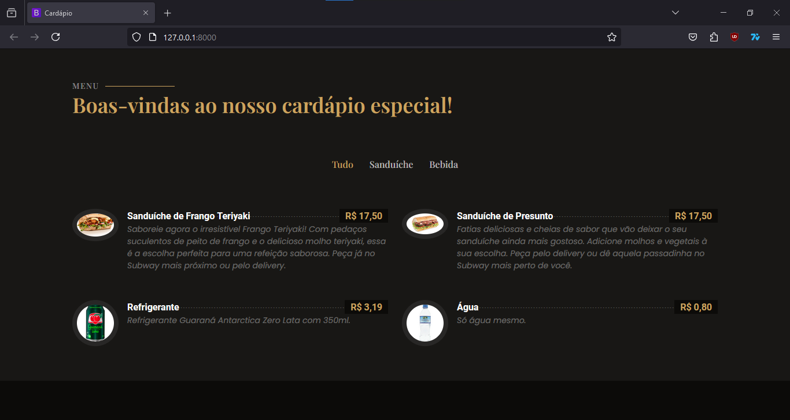

## Projeto: Cardápio Virtual

- **Autor:** Bruno Henrique

- **Descrição:** Cardápio virtual feito como estudo de Django (Python).

- **Template (Front-end):** [Restaurantly](https://bootstrapmade.com/restaurantly-restaurant-template/)

- **Resultado:**

